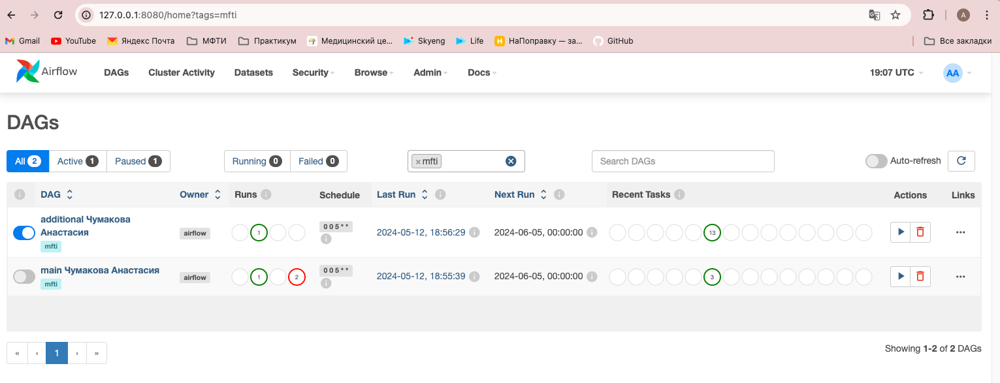
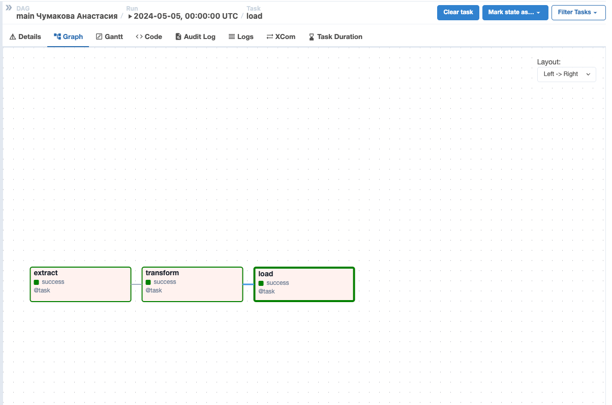
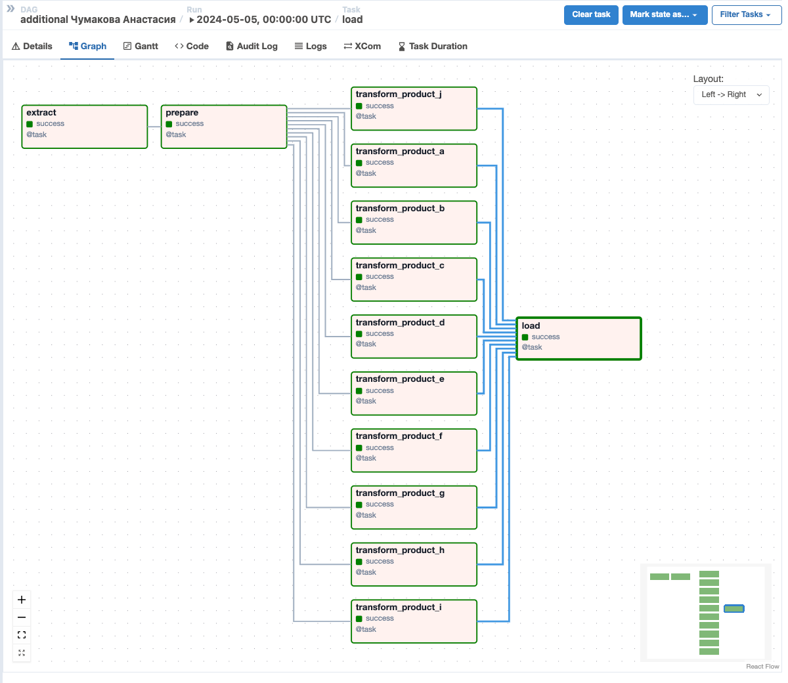

# Отработка навыков работы с Airflow
## Краткое описание задачи:
В этом задании Вам предстоит создать DAG в Apache Airflow, который будет по расписанию запускать расчет витрины активности клиентов по сумме и количеству их транзакций.

## Подробнее:
Нужно наладить следующий ETL-процесс:

1. Extract. Необходимые данные хранятся в таблице profit_table.csv. Это таблица, в которой для каждого клиента по 10-ти продуктам собраны суммы и количества транзакций за каждый месяц.

Что в названиях столбцов:

 - id - уникальный идентификатор клиента;
 - продукты обозначены буквами от a до j латинского алфавита;
 - сумма транзакций по соответствующим продуктам начинается с sum_…;
 - количество транзакций по соответствующим продуктам начинается с count_….
Для примера в таблице содержатся данные с октября 2023 года по март 2024.

2. Transform. Суть витрины, которую необходимо собрать, таблица с флагами активностей клиентов по продуктам. Методика расчёта следующая: клиент считается активным по продукту за дату X, если в предыдущие 3 месяца (X, X-1 и X-2) у него были ненулевая сумма и количество транзакций по нему.

Но это всё за нас уже реализовали дата-саентисты. Их код для сбора итоговой витрины находится в функции transform в файле transform_script.py, его необходимо встроить в процесс.

3. Load. Итоговые результаты необходимо сохранять в csv-файл flags_activity.csv в той же директории, не перезатирая при этом данные старых расчётов в нём (обратите внимание, последнее не реализовано в примере кода от дата-саентиста, подумайте, какой параметр добавить при сохранении, чтобы всё прошло корректно).

Особенности дага: он должен запускаться по расписанию каждый месяц 5-го числа. Предполагается, что данные profit_table хранятся в общедоступной директории и пополняются ежемесячно новыми данными - поэтому при чтении таблицы всё должно выполниться без ошибок при наличии данных.

Какой ожидаем увидеть результат:
Необходимо реализовать DAG в Apache Airflow по указанной выше инструкции. В качестве ответа на задание приложите код создания дага и налаженного etl-процесса; а также скрин графа в Airflow и его успешного запуска на главной странице.

## Успешные запуски

## Успешный запуск основного DAG-а

## Успешный запуск дополнительного DAG-а
